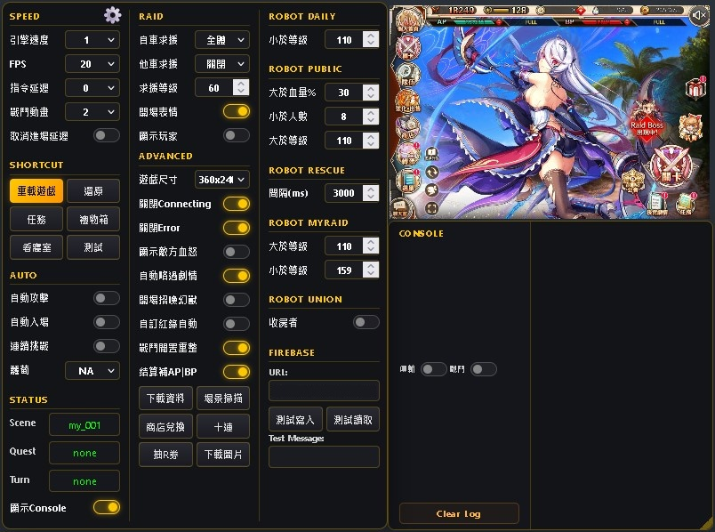

```markdown
# Promiscuous Kamihime

A Tampermonkey userscript designed for the game *Kamihime Project*. 
This script extends game behavior, unlocks hidden potential, and improves overall usability and interaction flow across various supported platforms.



## Features
* **Multi-Platform Support**: Compatible with DMM, Fanza, Johren, Nutaku, EroLabs, and bana-bana.
* **Automation & Flow Improvement**: Automatically runs on matched game pages to enhance in-game interaction and streamline the overall flow.
* **Zero Configuration**: Ready to use right out of the box with no manual setup required.
* **Advanced Customization**: Injects a custom UI panel allowing for game speed adjustments, advanced macros, and quick task automation[cite: 2].

## Supported Sites
* DMM
* Fanza
* Johren
* Nutaku
* EroLabs
* bana-bana

## Installation on Tampermonkey
1. **Install Tampermonkey**: First, ensure you have the Tampermonkey extension installed in your web browser.
2. **Create a New Script**: Open the Tampermonkey dashboard and create a new userscript.
3. **Paste the Code**: Copy the entire contents of `PromiscuousKamihime.js` and paste it into the editor.
4. **Save and Play**: Save the script, then simply open the game page. 

## Usage
The script runs automatically on supported game pages. You don't need to configure anything beforehand. Simply launch the game, and the extended features (such as the control panel) will become available immediately.

## Files
* `PromiscuousKamihime.js`: The main userscript file.
* `README.md`: This documentation file.

## Notes
* **Unofficial Tool**: This is an unofficial third-party tool. Please use it at your own risk.
* **Compatibility**: Future game updates may break the script's functionality.

## Author
**Kaneshiro Takeshi**

## Misc
I am an enthusiast rather than a professional JavaScript developer, so my coding style and naming conventions might seem unconventional to experienced programmers. I appreciate your understanding. 

This is only my second JavaScript project, with my first being simple visual effects for a personal website. Please note that there may not be future updates or a next version for this script.